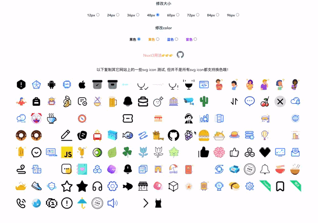

# vite-plugin-svgs-icons
[English documentation](README.en.md) 

[Nuxt3 nuxt-svg-icon](https://github.com/335296558/nuxt-svg-icon)

#### 介绍
    一个svg图标的插件，无需每个svg都发起http请求, 内置组件可以改变svg color、size【仅支持单色】
    



#### installation
    yarn add vite-plugin-vue-svg-icons -D

    npm i vite-plugin-vue-svg-icons -D

    pnpm add vite-plugin-vue-svg-icons -D

#### vite.config.js 使用说明
```js
    import vitePluginVueSvgIcons from 'vite-plugin-vue-svg-icons'
    export default defineConfig({
        plugins: [
            vitePluginVueSvgIcons()
        ],
    })
```
#### vitePluginVueSvgIcons 方法传参，Object， 如果不需要的svg图标建议不要放在目录下

| 参数名 | 类型 | 描述 | 默认值 |
| -------- | -------- | -------- | -------- |
|dir|String|存放svg图标的目录|path.resolve(__dirname, 'src', 'assets', 'svg')|
<!-- |moduleId|String|定义导入名称|virtual:svg-icon| -->
```js
    // 目录，注意 multicolor相关的 v3.1.4开始，废弃
    // 多色无法修改color
    // 可多级目录，但不会把目录名称加在svg名称中，所以svg 名称要是唯一的喔
    |assets
        |svg
            |xxx
                xxx.svg
                xxx.svg
                xxx.svg
            xxx.svg
            xxx.svg
            xxx.svg
```
#### svg组件使用说明
```js
    // app.vue 局部注册使用
    <script setup>
        import svgIcon from 'svg-icon'
    </script>
    // name参数是svg文件名称，比如：svg/logo.svg
    // 那么你引用这个svg 只需要name="logo"
    <template>
        // 可以这样
        <svgIcon name="logo" color="#f00" size="80" />
        // 也可以这样，如果你是H5，推荐这种喔
        <svgIcon name="logo" style="color:#f00;width: 80px;height:80px" />
    </template>
```

```js
    // main.js 全局注册，不推荐哈，推荐局部导入即可
    import svgIcon from 'svg-icon'
    VueApp.component('svg-icon', svgIcon);
```

#### 组件参数说明
| 参数名 | 类型 | 默认值 |
| -------- | ------- | -------- |
|name|String|必需设置name，与文件名称一样， 否则不显示哦。name参数是svg文件名称，比如：svg/logo.svg 那么你引用这个svg 只需要name="logo"|
|color|String| 设置颜色 仅支持单色svg|
|size|String、Number、Array| - |

<!-- [示列图像]() -->


#### 版本描述：
    v >= v3.1.5 
        1、优化与修复有些svg无法显示问题【但依然是会有些特殊的svg无法使用】
        2、增加支持热更新
    v3.1.4 > 🤪
    v3.1.2 > 优化了build配置, 优化导入方式!
    v3.1.0 > 升级新版, 更换构建工具vite
    v3.0.21 < 小于这个版本的放弃与删除了！升级新版
    v3.0.21 正常版
    v3.0.22 优化内部定义的id：给id增加前缀

🤡👻👽👾🤖😈🤠👺👹😉😜🤪🤪🤪🤪