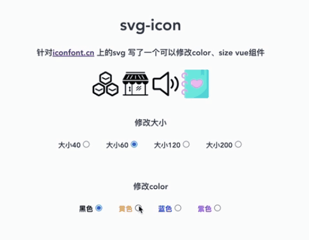

# vite-plugin-vue-svg-icons
[English](README.en.md) | 简体中文｜[v3.0.0 README.3.0.md](README.3.0.md)
#### introduce
    An SVG icon plug-in without each SVG a HTTP request component can change the color, size, support all the I

#### version
    2022-5-28，The new v 3 0 0 using SVG use to copy，No longer shows the SVG source code directly,
    See the README 3 0 md document
    
    Version 1.1.6 is directly shows the SVG

[v3.0.0 README.3.0.md](README.3.0.md)

</img>   
#### install
    yarn add vite-plugin-vue-svg-icons -D

    npm i vite-plugin-vue-svg-icons -D

    pnpm add vite-plugin-vue-svg-icons -D

#### vite.config.js instructions
```js
    import vitePluginVueSvgIcons from 'vite-plugin-vue-svg-icons'
    export default defineConfig({
        plugins: [
            vitePluginVueSvgIcons(Object)
        ],
    })
```
#### vitePluginVueSvgIcons Methods the reference，Object， If you don't need to SVG icon is not recommended in the directory

| param | type | description | default |
| -------- | -------- | -------- | -------- |
|dir|String|SVG icon directory|`${process.cwd()}/src/assets/svg`|

#### The instructions on the SVG components
```js
    // app.vue Local registration using
    <script setup>
        import svgIcon from 'svg-icon'
    </script>
    // name Param is written definition file name，比如：svg/logo.svg，So what do you refer to the SVG Need only name="logo"
    <template>
        <svgIcon name="logo" color="#f00" size="80" />
    </template>
```

```js
    // main.js All registered
    import svgIcon from 'svg-icon'
    VueApp.component('svg-icon', svgIcon);
```

#### Component parameters that
| param | type | default |
| -------- | -------- | -------- |
|name|String|-|
|color|String|SVG bring values do not set will not change the color SVG originally|
|size|Number|The default 15 px set to false, no default values, SVG size will not be set|
|class|String|-|

<!-- [示列图像]() -->